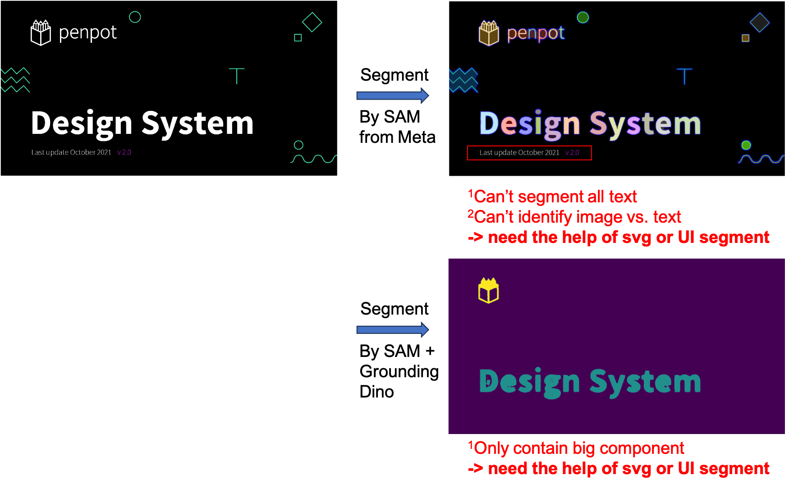
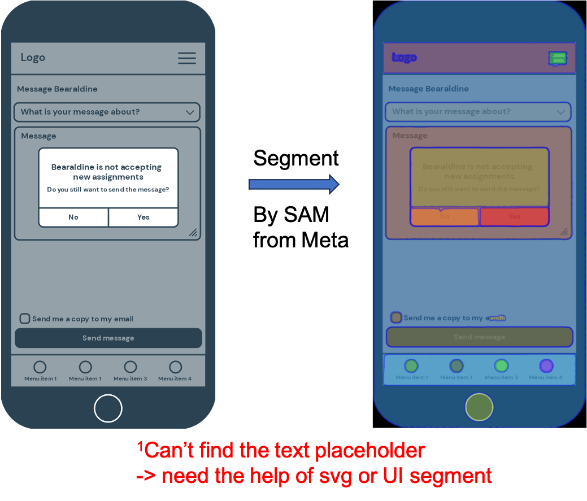
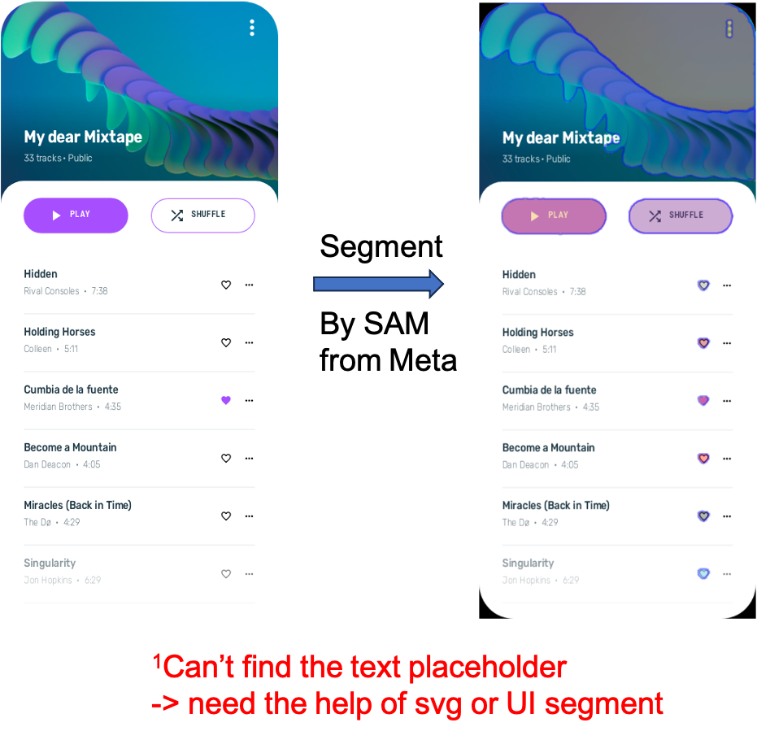

# Approach #2 | Text-to-image or Image-to-text in whole design
    
The system will help users to generate raster images to fulfill the design based on the existing text in the design. The text/image could be mutually replaced.

| Technology readiness | Risks | Complexity |
| ----- | ----- | ---------- |
| 
 🟡 Some elements are available but require adaptation | 
 🟡 Moderate risk | 
 🟠 Moderately complex |

## Technology Pipeline

Step #1) Leverage `top-down` ([UI segment](https://dl.acm.org/doi/pdf/10.1145/3411764.3445186)) and `bottom-up` (SVG segment) solutions to separate image/text placeholders.

Step #2) Using open-source model, vgg-19 [[PyTorch](https://pytorch.org/hub/pytorch_vision_vgg/)], textual inversion [[Github](https://github.com/rinongal/textual_inversion)] or style transfer-related methods, to analyze the style of selected components. (mimic the selection within [Recraft.ai](http://recraft.ai/))
    
Step #3) Based on input text prompts, the system will generate/control new contents with compatible styles. Several state-of-the-art academic solutions are available here.

Text-to-RasterImage generator:

- Latent Diffusion Model [[Paper](references/research_papers/LDM.pdf)] [[Github](https://github.com/CompVis/latent-diffusion)]

- Composable-Diffusion: support compositional text prompt [[Website](references/research_papers/Compositional-Visual-Generation-with-Composable-Diffusion-Models.pdf)] [[Github](https://github.com/energy-based-model/Compositional-Visual-Generation-with-Composable-Diffusion-Models-PyTorch)]

- ControlNet: adding more control by image/sketch [[Paper](references/research_papers/ControlNet.pdf)] [[Github](https://github.com/lllyasviel/ControlNet)] [[WebUI extension](https://github.com/Mikubill/sd-webui-controlnet)]

- GigaGAN [[Website](https://mingukkang.github.io/GigaGAN/)]

- Editing images:
    - GroundingDINO: regional image editing [[Github](https://github.com/IDEA-Research/GroundingDINO/blob/main/demo/image_editing_with_groundingdino_gligen.ipynb)]
    - Drag-your-GAN [[Website](https://vcai.mpi-inf.mpg.de/projects/DragGAN/)] [[Github](https://github.com/XingangPan/DragGAN)]
    - Edit Everything [[paper](references/research_papers/EditEverything.pdf)] [[Github](https://github.com/DefengXie/Edit_Everything)]

## 🖼️ Experiment
> Why do we need both top-down (UI-segment) and bottom-up (svg element)?

Top-down image segmentation by Meta-SAM [[Website](https://segment-anything.com/demo#)] [[Github](https://github.com/facebookresearch/segment-anything)]

Try #1
    

Text placeholders extraction with SVG:

Try #2

→ Need the help of svg or UI segment

Try #3

**Requirements**
    
- ML model:
    - Raster image segmentation:
        - Segment-anything [[Github](https://github.com/facebookresearch/segment-anything)]
        - GroundingDINO [[Github](https://github.com/IDEA-Research/GroundingDINO)]
        - Grounded-Segment-Anything [[Github](https://github.com/IDEA-Research/Grounded-Segment-Anything)] = Segment-anything [[Github](https://github.com/facebookresearch/segment-anything)] + GroundingDINO [[Github](https://github.com/IDEA-Research/GroundingDINO)]
        - ODISE [[Github](https://github.com/NVlabs/ODISE)]: could extent to the usage in UI segmentation
    - UI segmentation:
        - Screen Recognition [[Paper](references/research_papers/ScreenRecognition.pdf)]
        - Screen Parsing [[Paper](references/research_papers/ScreenParsing.pdf)]
    
    - Style analysis model: 
        - vgg-19 [[PyTorch](https://pytorch.org/hub/pytorch_vision_vgg/)]
        - textual inversion [[Github](https://github.com/rinongal/textual_inversion)]
    - Image-to-text: GPT4
- A python script for extracting text placeholders
- Input: a design with selected images or texts
- Output: a design adding compatible generated texts or images to the input design
- Dataset:
    - UI segmentation [[Rico’17](https://www.kaggle.com/datasets/onurgunes1993/rico-dataset)]: a publicly available dataset of 80,000 Android screens
    - Decent designs: for finetuning Text-to-RasterImage and Image-to-text generators

## Relevant works

[Research] 

- VectorFusion [[Paper](references/research_papers/VectorFusion.pdf)]: text-to-image-to-vector method
- IconShop [[Paper](references/research_papers/IconShop.pdf)]: The key to the success of IconShop is to exploit the sequential nature of SVG. Design a transformer-based architecture to achieve text-to-SVG.
    - with black-and-white icon dataset, [FIGR-8](https://github.com/marcdemers/FIGR-8)
- Raster-to-Vector tool: open-source model Vtracer [[Github](https://github.com/visioncortex/vtracer)]

[Business solutions]

Recraft.ai

- References: [[Website](https://www.recraft.ai/)] [[Product Hunt](https://www.producthunt.com/posts/recraft-ai?utm_source=badge-featured&utm_medium=badge&utm_souce=badge-recraft-ai)][[Demo](https://youtu.be/91_i0YcsP0o)]
- Support: (a) text prompt to svg, (b) image modification with prompt, (c) fix issues for user selected region, (d) can specify target styles
- Output format: png, jpg (512x512 & 1024x1024), SVG, Lottie
- **Try some results**: some are awesome; some are not impressive, even in the simple text prompt
    - **Awesome ones**
        
        .png)
        
        
        
        with complex details
        
        
    - **Not impressive ones**
        
        _text_prompt_to_svg.png)
        
        Not impressive one, even in simple prompt “hand”
        
        

iconomy.app

- Reference: [[Try the Demo](https://run.iconomy.app/)]
- 👍 have web UI; the result is acceptable
    
    
    
- 👎 no API; only 5 trys for free

- Adobe Vectorisation [[Website](https://www.adobe.com/express/feature/image/convert/svg)]

## Pros and Cons

🟢 Pros

- Could leverage foundation models to generate decent raster image (if we choose the solution of raster-to-svg)
- Have two state-of-the-art research solutions with different generative architectures for guidance
- Have sufficient dataset

🔴 Cons

- No respective open-source Github repo available for checking the performance of the research paper
- Generation quality has the risk of not meeting the designer's requirements since there is limited research on SVG generation
