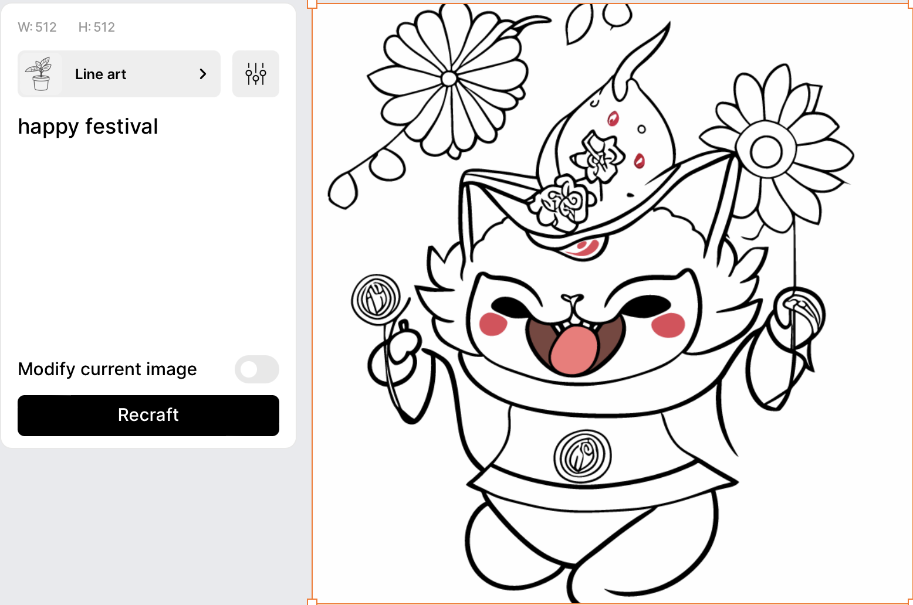
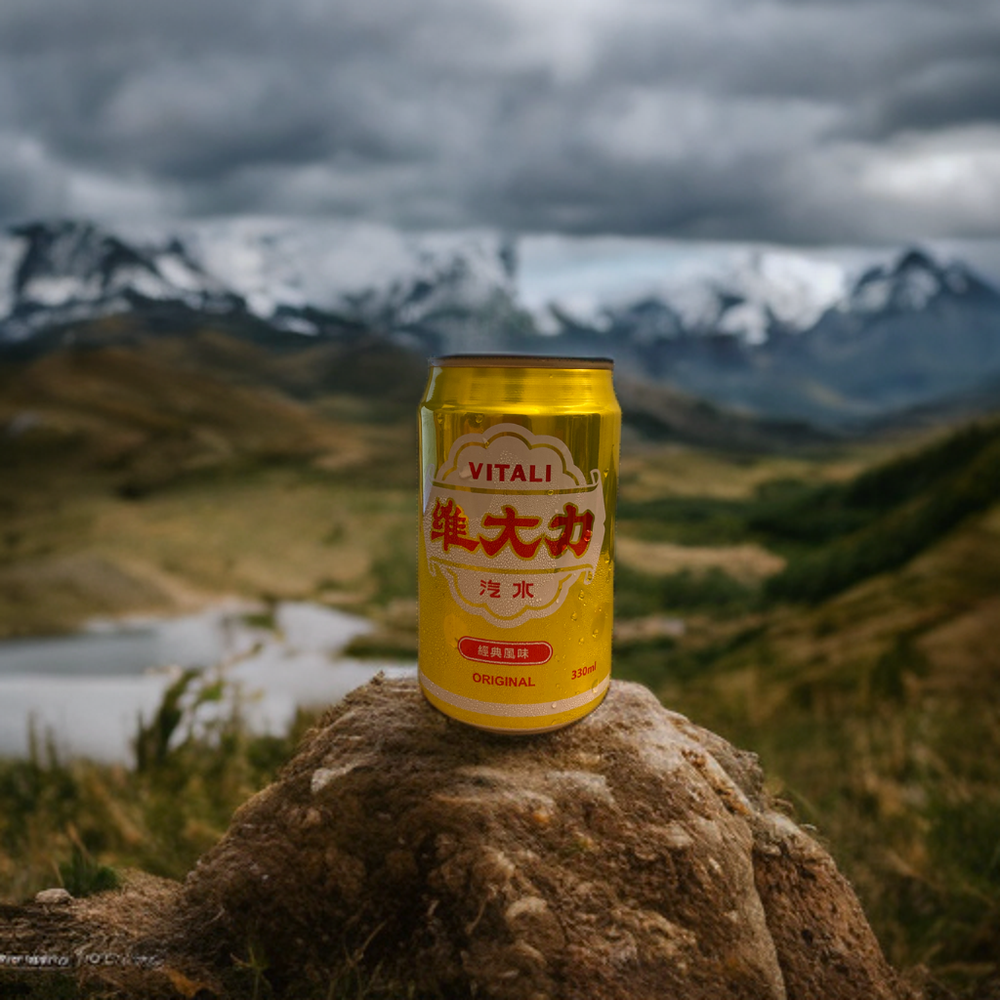

# Approach #2 | Text-to-image or Image-to-text in whole design
    
The system will help users to generate raster images to fulfill the design based on the existing text in the design. The text/image could be mutually replaced.

| Technology readiness | Risks | Complexity |
| ----- | ----- | ---------- |
| 
 üü° Some elements are available but require adaptation | 
 üü° Moderate risk | 
 🟠 Moderately complex |

## Technology Pipeline

Step #1) Leverage `top-down` ([UI segment](https://dl.acm.org/doi/pdf/10.1145/3411764.3445186)) and `bottom-up` (SVG segment) solutions to separate image/text placeholders.

Step #2) Using open-source model, vgg-19 [[PyTorch](https://pytorch.org/hub/pytorch_vision_vgg/)], textual inversion [[Github](https://github.com/rinongal/textual_inversion)] or style transfer-related methods, to analyze the style of selected components. (mimic the selection within [Recraft.ai](http://recraft.ai/))
    
Step #3) Based on input text prompts, the system will generate/control new contents with compatible styles. Several state-of-the-art academic solutions are available here.

Text-to-RasterImage generator:

- Latent Diffusion Model [[Paper](references/research_papers/LDM.pdf)] [[Github](https://github.com/CompVis/latent-diffusion)]

- Composable-Diffusion: support compositional text prompt [[Website](references/research_papers/Compositional-Visual-Generation-with-Composable-Diffusion-Models.pdf)] [[Github](https://github.com/energy-based-model/Compositional-Visual-Generation-with-Composable-Diffusion-Models-PyTorch)]

- ControlNet: adding more control by image/sketch [[Paper](references/research_papers/ControlNet.pdf)] [[Github](https://github.com/lllyasviel/ControlNet)] [[WebUI extension](https://github.com/Mikubill/sd-webui-controlnet)]

- GigaGAN [[Website](https://mingukkang.github.io/GigaGAN/)]

- Editing images:
    - GroundingDINO: regional image editing [[Github](https://github.com/IDEA-Research/GroundingDINO/blob/main/demo/image_editing_with_groundingdino_gligen.ipynb)]
    - Drag-your-GAN [[Website](https://vcai.mpi-inf.mpg.de/projects/DragGAN/)] [[Github](https://github.com/XingangPan/DragGAN)]
    - Edit Everything [[paper](references/research_papers/EditEverything.pdf)] [[Github](https://github.com/DefengXie/Edit_Everything)]

## 🖼️ Experiment
> Experimenting for the reason that we need both top-down (UI-segment) and bottom-up (svg element)

Top-down image segmentation by Meta-SAM [[Website](https://segment-anything.com/demo#)] [[Github](https://github.com/facebookresearch/segment-anything)]

Try #1
    

Text placeholders extraction with SVG:

| Try #2 | Try #3 |
| --- | --- |
|  |  |

→ Need the help of svg or UI segment

## Requirements
    
- ML model:
    - Raster image segmentation:
        - Segment-anything [[Github](https://github.com/facebookresearch/segment-anything)]
        - GroundingDINO [[Github](https://github.com/IDEA-Research/GroundingDINO)]
        - Grounded-Segment-Anything [[Github](https://github.com/IDEA-Research/Grounded-Segment-Anything)] = Segment-anything [[Github](https://github.com/facebookresearch/segment-anything)] + GroundingDINO [[Github](https://github.com/IDEA-Research/GroundingDINO)]
        - ODISE [[Github](https://github.com/NVlabs/ODISE)]: could extent to the usage in UI segmentation
    - UI segmentation:
        - Screen Recognition [[Paper](references/research_papers/ScreenRecognition.pdf)]
        - Screen Parsing [[Paper](references/research_papers/ScreenParsing.pdf)]
    
    - Style analysis model: 
        - vgg-19 [[PyTorch](https://pytorch.org/hub/pytorch_vision_vgg/)]
        - textual inversion [[Github](https://github.com/rinongal/textual_inversion)]

    - Text-to-RasterImage generator:

        - Latent Diffusion Model [[Paper](references/research_papers/LDM.pdf)] [[Github](https://github.com/CompVis/latent-diffusion)]

        - Composable-Diffusion: support compositional text prompt [[Website](references/research_papers/Compositional-Visual-Generation-with-Composable-Diffusion-Models.pdf)] [[Github](https://github.com/energy-based-model/Compositional-Visual-Generation-with-Composable-Diffusion-Models-PyTorch)]

        - ControlNet: adding more control by image/sketch [[Paper](references/research_papers/ControlNet.pdf)] [[Github](https://github.com/lllyasviel/ControlNet)] [[WebUI extension](https://github.com/Mikubill/sd-webui-controlnet)]

        - GigaGAN [[Website](https://mingukkang.github.io/GigaGAN/)]

        - Editing images:
            - GroundingDINO: regional image editing [[Github](https://github.com/IDEA-Research/GroundingDINO/blob/main/demo/image_editing_with_groundingdino_gligen.ipynb)]
            - Drag-your-GAN [[Website](https://vcai.mpi-inf.mpg.de/projects/DragGAN/)] [[Github](https://github.com/XingangPan/DragGAN)]
            - Edit Everything [[paper](references/research_papers/EditEverything.pdf)] [[Github](https://github.com/DefengXie/Edit_Everything)]
    
    - Image-to-text: GPT4
- A python script for extracting text placeholders
- Input: a design with selected images or texts
- Output: a design adding compatible generated texts or images to the input design
- Dataset:
    - UI segmentation [[Rico’17](https://www.kaggle.com/datasets/onurgunes1993/rico-dataset)]: a publicly available dataset of 80,000 Android screens
    - Decent designs: for finetuning Text-to-RasterImage and Image-to-text generators

## Relevant works

[Research] 

List above in the requirements

[Business solutions]

Recraft.ai

- References: [[Website](https://www.recraft.ai/)] [[Product Hunt](https://www.producthunt.com/posts/recraft-ai?utm_source=badge-featured&utm_medium=badge&utm_souce=badge-recraft-ai)][[Demo](https://youtu.be/91_i0YcsP0o)]
- Support: (a) text prompt to svg, (b) image modification with prompt, (c) fix issues for user selected region, (d) can specify target styles
- Output format: png, jpg (512x512 & 1024x1024), SVG, Lottie
- **Try some results**: some are awesome; some are not impressive, even in the simple text prompt
    - **Awesome ones**
        
        .png)
        
        
        
        with complex details
        
        
    - **Not impressive ones**
        
        _text_prompt_to_svg.png)
        
        Not impressive one, even in simple prompt “hand”
        
        

flair.ai

- Reference: [[Website](https://flair.ai/)] [[Demo](https://twitter.com/flairAI_)]
- based on (a) product image and (b) text prompt, generate the final design
 - **Learning**
            
    We could learn its UX design, providing `text chunk hint` and `template design along its text prompt` to assist users to input more specific text prompts and get results with expected performance
    
    ![flair demo [eng].png](reports/figures/flair_demo_eng.png)
    
- **Try some results**:
    
    Prompt: **"vitali on top of a natural hill, in front of mountains and cloudy skies in the background"**
    
    
    
    Prmpot: **"vitali emerging from ripples in a lake surrounded by plants and flowers, with sunlight streaming down"**
    
    
    
    The results considering contours and text prompt is not impressive:
    
    Prompt: **"vitali on hand with hot air balloon floating in the background, in front of mountains and cloudy skies in the background"**
    
    

- Microsoft Designer [[Website](https://designer.microsoft.com/)]

## Pros and Cons

🟢 Pros
    
- Could leverage foundation models to generate decent raster image
- More research-active area

🔴 Cons

- The open-source UI segment dataset is old, published in 2017, which might be out of date. We might need to collect and annotate a new one by ourselves
- Generation quality has the risk of not meeting the designer's requirements
